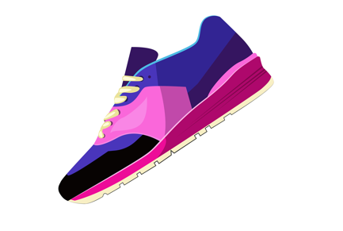

# カラースイッチャー商品カード

## 概要
このコンポーネントは、商品の色バリエーションを選択できるインタラクティブな商品カードです。選択した色に応じて商品画像が切り替わる機能を実装しています。

## 実装方法

### 1. HTML構造
```html
<div class="color-options">
   <label for="">カラー選択: </label>
    <div class="color-option purple">
        <input type="radio" id="color-purple" name="color" value="purple" checked>
        <label for="color-purple"></label>
    </div>
    <!-- 他の色オプションも同様に -->
</div>

<div class="product-images">
    
    <!-- 他の色の画像も同様に -->
</div>
```

### 2. CSS実装
```css
/* カラーオプションのスタイリング */
.color-option {
    width: 30px;
    height: 30px;
    border-radius: 50%;
    cursor: pointer;
    transition: all 0.3s ease;
    position: relative;
    padding: 3px;
    background-color: #fff;
    box-shadow: 0 2px 5px rgba(0, 0, 0, 0.1);
}

/* 選択中の色オプションのスタイル */
.color-option input[type="radio"]:checked + label {
    transform: scale(1.2);
    box-shadow: 0 0 0 3px #fff, 0 0 0 6px #3498db;
}

/* チェックマークの表示 */
.color-option input[type="radio"]:checked + label::after {
    content: '✓';
    position: absolute;
    top: 50%;
    left: 50%;
    transform: translate(-50%, -50%);
    color: white;
    font-size: 14px;
    font-weight: bold;
}
```

### 3. JavaScript実装
```javascript
const colorOptions = document.querySelectorAll('.color-option input');
const productImages = document.querySelectorAll('.product-images img');

colorOptions.forEach((option) => {
    option.addEventListener('change', (event) => {
        const selectedColor = event.target.value;
        
        // すべての画像を非表示
        productImages.forEach((image) => {
            image.classList.remove('active');
        });
        
        // 選択された色の画像を表示
        const selectedImage = document.querySelector(`.product-images img.${selectedColor}`);
        selectedImage.classList.add('active');
    });
});
```

## 実装のポイント

1. **色オプションの実装**
   - ラジオボタンを使用して、一度に1つの色のみ選択可能
   - カスタムスタイリングでラジオボタンを非表示にし、代わりにカラーピッカーとして表示
   - 選択状態を視覚的に分かりやすく表示（拡大、チェックマーク、二重の輪郭）

2. **画像切り替えの実装**
   - 各色に対応する画像を用意
   - `active`クラスを使用して表示/非表示を制御
   - CSSトランジションでスムーズな切り替え効果を実現

3. **アクセシビリティ**
   - 適切な`alt`属性で画像の説明を提供
   - キーボード操作に対応
   - 十分なコントラスト比を確保

## カスタマイズ方法

1. **色の追加**
   - HTMLに新しい色オプションを追加
   - 対応する画像を用意
   - CSSに新しい色のスタイルを追加

2. **スタイルの変更**
   - カラーオプションのサイズや形状を変更
   - 選択時のエフェクトをカスタマイズ
   - アニメーションの速度や効果を調整

## 注意点
- 画像は同じサイズで用意することを推奨
- モバイル対応のため、タッチ操作にも配慮
- パフォーマンスを考慮し、画像の最適化を推奨 